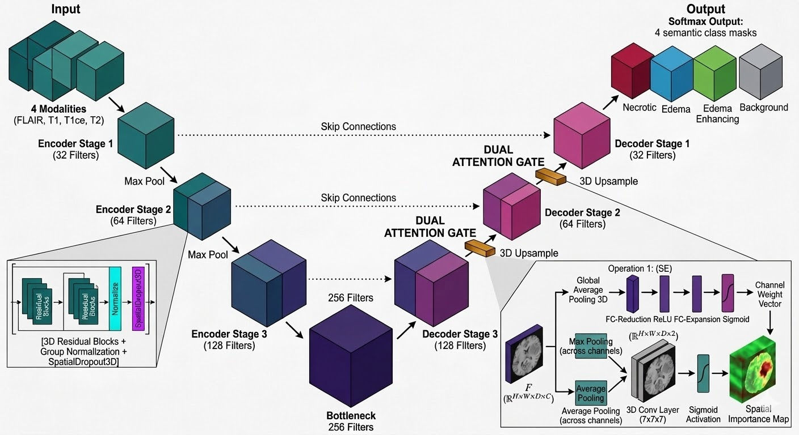

# Brain Tumor Segmentation Using 3D Residual Attention U-Net

A deep learning project for automated brain tumor segmentation from multi-modal 3D MRI scans using the BraTS 2021 dataset.

This project implements a 3D Residual Attention U-Net incorporating Squeeze-and-Excitation (SE) blocks and attention gates to perform four-class voxel-level brain tumor segmentation.

## Project Overview

Brain tumor segmentation is a challenging task in medical image analysis due to the irregular shape, heterogeneous appearance, and relatively small volume of tumor regions within MRI scans.

This project develops an end-to-end deep learning pipeline that processes four MRI modalities:

- FLAIR
- T1
- T1ce
- T2

The model predicts a segmentation mask for each voxel of the input 3D MRI volume.

The proposed pipeline combines:

- 3D residual learning
- Attention-gated skip connections
- Squeeze-and-Excitation blocks
- Tumor-aware patch sampling
- Focal Tversky Loss
- Dice Loss
- Sliding-window inference
- Gaussian-weighted prediction aggregation
- Morphological post-processing

## Objectives

- Perform automated 3D brain tumor segmentation from MRI scans.
- Utilize multiple MRI modalities for richer feature representation.
- Reduce irrelevant background information through ROI extraction.
- Address tumor/background class imbalance using tumor-aware patch sampling.
- Improve feature propagation using residual connections.
- Focus the network on relevant regions using attention gates.
- Enhance channel-wise feature representation using SE blocks.
- Evaluate segmentation using BraTS tumor-region definitions.

## Dataset

The project uses the BraTS 2021 (Brain Tumor Segmentation) dataset.

Each patient contains four MRI modalities:

| Modality | Description |
|----------|-------------|
| FLAIR | Fluid-Attenuated Inversion Recovery |
| T1 | T1-weighted MRI |
| T1ce | Contrast-enhanced T1-weighted MRI |
| T2 | T2-weighted MRI |

The four modalities are combined as the input channels to the 3D segmentation network.

### Dataset Selection

The notebook selects up to 600 patients using:

random_state = 42

The selected data is divided into:

- 500 training patients
- 100 validation patients

## Methodology

The overall pipeline consists of:

Multi-modal MRI
        ↓
ROI Extraction
        ↓
Intensity Normalization
        ↓
3D Patch Extraction
        ↓
Tumor-aware Sampling
        ↓
Data Augmentation
        ↓
3D Residual Attention U-Net
        ↓
4-Class Segmentation
        ↓
Sliding-Window Inference
        ↓
Gaussian-weighted Aggregation
        ↓
Post-processing
        ↓
BraTS Evaluation

## Preprocessing

### 1. ROI Extraction

The FLAIR modality is used to identify the brain region.

A non-zero mask is generated from the FLAIR volume and used to determine the brain ROI.

This reduces unnecessary background voxels and focuses processing on the relevant region.

### 2. Intensity Normalization

Each MRI modality is normalized using statistics calculated from its non-zero region.

This helps reduce intensity variation between MRI scans.

### 3. Padding

Volumes are padded when necessary to allow consistent extraction of 3D training patches.

### 4. Label Processing

The segmentation labels are processed into four classes:

- Class 0 → Background
- Class 1 → Tumor
- Class 2 → Tumor
- Class 3 → Enhancing Tumor

## 3D Patch Extraction

Instead of processing complete MRI volumes during training, the project extracts 3D patches.

### Configuration

| Parameter     | Value |
|------------   |-------|
| Patch Size    | 128 × 128 × 128 |
| Stride        | 64 |
| Batch Size    | 2 |
| No of Classes | 4 |

A tumor-aware sampling strategy is used to increase the probability of selecting informative tumor regions.

The sampling strategy approximately uses:

- 40% samples centered around class 3
- 40% samples from tumor regions
- Remaining samples from general regions

This helps address the significant imbalance between tumor and background voxels.

## Data Augmentation

The training pipeline applies random 3D augmentations including:

- Random flips along spatial axes
- Random 90-degree rotations
- Random intensity scaling
- Random intensity shifting
- Intensity clipping

The implemented intensity transformations include:

Scaling: 0.9 – 1.1  
Shift: ±0.1  
Clip: [-5, 5]

## Model Architecture

The project uses a 3D Residual Attention U-Net with Squeeze-and-Excitation blocks.

The network follows an encoder-decoder architecture.

### Encoder

The encoder progressively extracts high-level spatial features using:

32 → 64 → 128 → 256 filters

### Bottleneck

The bottleneck uses:

512 filters

### Decoder

The decoder progressively reconstructs the segmentation using:

256 → 128 → 64 → 32 filters

The final layer produces a four-class softmax segmentation.

## Residual Blocks

The residual blocks combine:

- Conv3D
- Group Normalization
- ReLU activation
- Spatial Dropout
- Squeeze-and-Excitation
- Residual shortcut connections

Configuration:

Group Normalization Groups: 8  
Spatial Dropout: 0.20

Residual connections allow information and gradients to propagate more effectively through the network.

## Squeeze-and-Excitation Blocks

Squeeze-and-Excitation blocks are incorporated into the residual blocks.

They perform channel-wise feature recalibration, allowing the network to emphasize informative feature channels.

## Attention Gates

Attention gates are applied to the skip connections between the encoder and decoder.

They help the decoder focus on relevant spatial features before combining encoder information with decoder features.

## Loss Function

The project uses a combined loss:

Combined Loss = Focal Tversky Loss + (1 − Dice Coefficient)

### Focal Tversky Parameters

α = 0.7  
β = 0.3  
γ = 0.75

The Focal Tversky component helps handle class imbalance and difficult segmentation regions, while the Dice component directly optimizes region overlap.

## Training

The model is implemented using TensorFlow/Keras.

Multi-GPU training is supported through:

tf.distribute.MirroredStrategy()

The recorded notebook environment detected two GPUs.

### Training Configuration

| Parameter | Value |
|-----------|-------|
| Patch Size | 128 × 128 × 128 |
| Stride | 64 |
| Batch Size | 2 |
| Epochs | 50 |
| Classes | 4 |

The training pipeline also supports checkpointing and training-log generation.

## Inference

Complete MRI volumes are segmented using a sliding-window inference strategy.

The volume is divided into overlapping 3D patches:

Patch Size: 128 × 128 × 128  
Stride: 64

Predictions from overlapping patches are combined using Gaussian weighting.

This produces a continuous segmentation over the complete volume and helps reduce patch-boundary artifacts.

## Post-processing

The predicted segmentation is refined using morphological operations.

The implemented post-processing includes:

- Binary closing
- Hole filling
- Enhancing tumor refinement

A threshold-based rule is also applied to very small enhancing tumor predictions:

If class 3 contains fewer than 400 voxels, class 3 predictions are converted to class 1.

## Evaluation

The project follows the tumor-region definitions used for BraTS evaluation.

### Whole Tumor (WT)

WT = Classes 1 + 2 + 3

### Tumor Core (TC)

TC = Classes 1 + 3

### Enhancing Tumor (ET)

ET = Class 3

Dice-based measurements are used to evaluate the segmentation quality of these regions.

## 📊 Results

The proposed 3D Residual Dual-Attention U-Net was evaluated on both the BraTS 2021 and BraTS 2020 datasets.

| Dataset | Whole Tumor (WT) | Tumor Core (TC) | Enhancing Tumor (ET) |
|---------|------------------|-----------------|----------------------|
| BraTS 2021 | 92.0% | 87.0% | 79.0% |
| BraTS 2020 | 90.0% | 85.0% | 73.0% |

The model achieved a 92.0% Whole Tumor Dice score, 87.0% Tumor Core Dice score, and 79.0% Enhancing Tumor Dice score on BraTS 2021. On the BraTS 2020 dataset, the model achieved 90.0%, 85.0%, and 73.0% Dice scores for Whole Tumor, Tumor Core, and Enhancing Tumor, respectively.

The evaluation demonstrates that the trained model maintains strong segmentation performance across different BraTS dataset releases.

## Technologies Used

| Category | Technologies |
|----------|-------------|
| Programming | Python |
| Deep Learning | TensorFlow, Keras |
| Medical Imaging | NiBabel |
| Numerical Computing | NumPy |
| Data Processing | Pandas, SciPy |
| Machine Learning | Scikit-learn |
| Visualization | Matplotlib |
| Environment | Kaggle, Jupyter Notebook |

## Repository Structure

Brain-Tumor-Segmentation/
│
├── README.md
├── requirements.txt
├── .gitignore
│
├── notebooks/
│   └── braintumor.ipynb
│
├── images/
│   ├── architecture.png
│   ├── modalities.png
│   ├── roi-cropping.png
│   └── segmentation-result.png
│
└── results/
    └── evaluation-results.txt

## Getting Started

### Clone the Repository

git clone https://github.com/katarianjali02/Brain-Tumor-Segmentation.git

### Navigate to the Project

cd Brain-Tumor-Segmentation

### Install Dependencies

pip install -r requirements.txt

### Run the Notebook

Open:

notebooks/braintumor.ipynb

The notebook was developed in a Kaggle GPU environment, so dataset paths may need to be modified when running the project locally.

## Model Checkpoints

The training workflow uses model weight files such as:

- best_model.weights.h5
- latest_model.weights.h5

Training history is stored in:

training_log.csv

Large datasets and model checkpoints are not intended to be stored directly in the GitHub repository.

## Limitations

- The implementation is primarily configured for a GPU-enabled Kaggle environment.
- 3D MRI training and inference require significant computational resources.
- Dataset paths are environment-dependent.
- The reported validation result is an intermediate evaluation and not a complete final benchmark.
- Additional testing on independent datasets would be required to assess generalization.

## Future Improvements

- Train and evaluate on the complete available dataset.
- Perform systematic hyperparameter optimization.
- Improve post-processing and tumor boundary refinement.
- Add additional evaluation metrics such as Hausdorff Distance.
- Add experiment tracking and reproducibility tools.
- Optimize inference time and GPU memory usage.
- Develop an interactive web-based segmentation interface.
- Containerize the application using Docker.
- Improve 3D visualization of predicted tumor regions.

## Author
Anjali

GitHub: https://github.com/katarianjali02

## Disclaimer

This project is intended for educational and research purposes only.

It is not intended for clinical diagnosis or medical decision-making.
